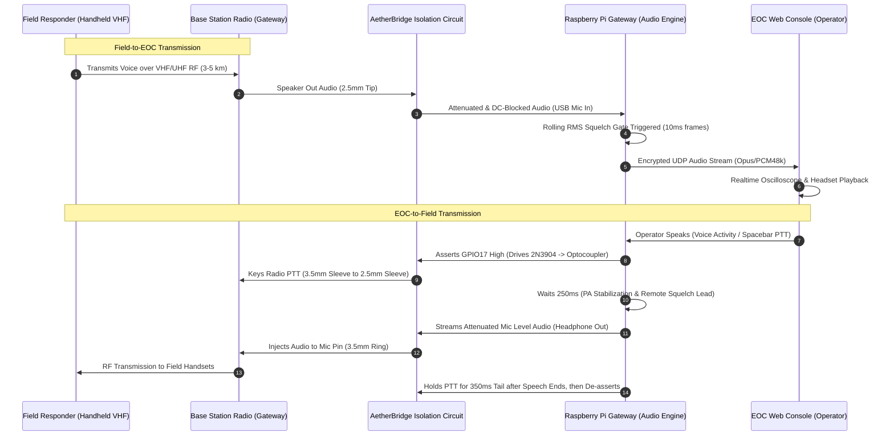

# 📖 SentinelBridge & AetherBridge — Technical Documentation

**Team Aether_100 (Team ID: `NITS_100`) · National Institute of Technology Silchar**  
*Problem Statement: SIH26223 · Theme: Disaster Management · Category: Hardware + AI Software*  
*Mentor: Dr. Koushik Guha · September 2026*

---

## 📑 Table of Contents
1. [Executive Summary & Purpose](#1-executive-summary--purpose)
2. [The Problem It Solves](#2-the-problem-it-solves)
3. [Design Principle — No New Transmitter](#3-design-principle--no-new-transmitter)
4. [Theory of Operation](#4-theory-of-operation)
   - [4.1 Field to EOC Signal Chain](#41-field-to-eoc-signal-chain)
   - [4.2 EOC to Field Signal Chain](#42-eoc-to-field-signal-chain)
   - [4.3 Half-Duplex Interlock System](#43-half-duplex-interlock-system)
5. [The Kenwood 2-Pin Accessory Port & Ground Loop Fault](#5-the-kenwood-2-pin-accessory-port--ground-loop-fault)
6. [Interface Circuit & Electrical Design](#6-interface-circuit--electrical-design)
   - [6.1 Strict Two Ground Nets Architecture](#61-strict-two-ground-nets-architecture)
   - [6.2 Connection Routing Table](#62-connection-routing-table)
   - [6.3 Transistor-Driven Optocoupler Switching Math](#63-transistor-driven-optocoupler-switching-math)
   - [6.4 Asymmetric Audio Level Matching & Calibration](#64-asymmetric-audio-level-matching--calibration)
7. [Software Engine & Audio Pipeline](#7-software-engine--audio-pipeline)
8. [FloodSense Predictive AI Architecture](#8-floodsense-predictive-ai-architecture)
9. [Hardware Bill of Materials (BOM)](#9-hardware-bill-of-materials-bom)
10. [Verification & Bench Test Protocol](#10-verification--bench-test-protocol)
11. [Demonstrated Behavior & Operational Scope](#11-demonstrated-behavior--operational-scope)
12. [Team & Hackathon Credits](#12-team--hackathon-credits)

---

## 1. Executive Summary & Purpose

**AetherBridge** is the low-cost Radio-over-IP (RoIP) hardware gateway subsystem of **SentinelBridge**. It enables continuous two-way voice communication between standard, unmodified handheld VHF/UHF radios in disaster zones and remote district **Emergency Operations Centres (EOCs)** over surviving IP networks (satellite, Wi-Fi mesh, wireline, or cellular).

The subsystem was engineered and validated independently from the hydrological flood-sensing tier to prove the radio-to-IP hardware chain before integration into the unified tactical console.

---

## 2. The Problem It Solves

During severe flood disasters (e.g., Barak Valley / Silchar basin inundations):
* **Infrastructure Collapse:** Terrestrial cellular base stations and fiber backhauls are submerged, power-cut, or saturated.
* **Range Limitation:** First responders rely on handheld VHF transceivers with line-of-sight range limited to **3–5 km**, while district EOCs are located 20–50 km away across inundated terrains.
* **High Barrier to Entry:** Commercial commercial RoIP appliances cost **₹2,00,000–₹5,00,000+** per station, utilize proprietary protocols, and often necessitate replacing entire radio fleets.

**AetherBridge** solves this by bridging the agency's existing base radio onto surviving IP networks using an open-architecture interface costing **~₹1,200** in components, requiring **zero modifications** to field handsets.

---

## 3. Design Principle — No New Transmitter

AetherBridge operates under a strict **"No New Transmitter"** design philosophy:
1. **No Proprietary RF Generation:** The gateway contains no RF amplifier, modulator, or oscillator.
2. **Accessory Tap Interfacing:** Audio is tapped directly from the base radio's auxiliary 2-pin accessory port.
3. **Optically Isolated Push-to-Talk (PTT):** PTT is closed electronically via an optocoupler switch — mimicking an operator pressing the physical microphone button.
4. **Regulatory & Spectrum Compliance:** All RF emissions originate exclusively from the agency's existing licensed VHF base station. No separate Wireless Planning & Coordination (WPC) spectrum allocation is required. Bench testing was carried out on 446.0–446.2 MHz at 0.5 W (WPC license-exempt PMR band).

---

## 4. Theory of Operation



### 4.1 Field to EOC Signal Chain
1. A field responder presses PTT on their handset and speaks.
2. The gateway base station receives the RF transmission and outputs audio on its 2.5 mm accessory speaker pin.
3. Audio passes through a DC-blocking film capacitor ($C_1 = 1.0\ \mu\text{F}$) and a 25-turn precision trimmer ($RV_1 = 10\text{ k}\Omega$) that scales speaker levels down to microphone input range.
4. The Raspberry Pi audio daemon processes incoming audio in **10 ms frames** (480 samples @ 48 kHz).
5. A **Rolling Root-Mean-Square (RMS)** software squelch algorithm detects speech against ambient background noise. When the threshold is crossed, the software gate opens and streams UDP packets across the IP network to the EOC console.
6. A software hang timer keeps the gate open across brief speech pauses to eliminate stuttering.

### 4.2 EOC to Field Signal Chain
1. The EOC dispatcher triggers transmission via Web Audio API (Spacebar hold or Voice Activity Gate).
2. The Raspberry Pi gateway receives voice frames and asserts **GPIO17 HIGH**.
3. GPIO17 activates an NPN switching transistor (`2N3904`), saturating the LED of a `PC817` optocoupler and bridging the radio's PTT line to ground.
4. **250 ms Lead Time:** The gateway delays audio playback by 250 ms to allow the radio's RF Power Amplifier (PA) to reach full output power and open the squelch gates of receiving handsets.
5. Headphone audio from the USB sound card passes through a $100\text{ k}\Omega$ series resistor, a 25-turn trimmer ($RV_2 = 10\text{ k}\Omega$), and a DC-blocking capacitor ($C_2 = 1.0\ \mu\text{F}$), scaling line-level down to $\approx 10\text{ mV}$ electret microphone sensitivity.
6. **350 ms Tail Time:** PTT remains asserted for 350 ms after audio termination to avoid clipping final consonants.
7. **30s Hard Watchdog:** A hardware/software watchdog unconditionally de-asserts PTT after 30 seconds to prevent stuck carrier lockouts.

### 4.3 Half-Duplex Interlock System
Standard two-way radios operate in simplex/half-duplex mode and cannot receive while transmitting. To prevent acoustic feedback squeals and electrical oscillation loops:
* While GPIO17 PTT is asserted, the gateway automatically discards local microphone input.
* The EOC console suppresses local microphone pickup for 400 ms following received audio packet bursts.

---

## 5. The Kenwood 2-Pin Accessory Port & Ground Loop Fault

Most commercial handheld transceivers (Baofeng, Kenwood, TYT, Retevis) utilize a molded two-pin connector combining a **3.5 mm TRS plug** and a **2.5 mm TRS plug** with 11 mm spacing.

| Plug & Contact | Radio Function | Harness Wire Color | Electrical Characteristics |
| :--- | :--- | :--- | :--- |
| **2.5 mm Tip** | Speaker Output ($+$) | Blue | $\approx 300 - 800\text{ mV}$ RMS audio |
| **2.5 mm Sleeve** | Speaker Ground / Radio Chassis Ground | Brown | True Radio Chassis Ground Net |
| **3.5 mm Ring** | Microphone Input ($+$) | Red | Electret input ($\approx 10 - 20\text{ mV}$) with DC bias |
| **3.5 mm Sleeve** | Microphone Return ($-$) & **PTT Sense** | Green | Pulled internally to $+3.3\text{V}/+5\text{V}$ logic |
| **3.5 mm Tip** | $+3.3\text{V}/+5\text{V}$ DC Accessory Supply | — | Unused / Floating |

### ⚠️ The Ground Loop Stuck Carrier Trap
Inside standard USB sound cards, the microphone input sleeve and headphone output sleeve share a single common ground plane.

If the harness is connected naively:
$$\text{Radio Chassis Ground (2.5mm Sleeve)} \longleftrightarrow \text{Sound Card Ground} \longleftrightarrow \text{PTT Sense Line (3.5mm Sleeve)}$$
This hard-shorts the PTT sense line directly to ground the moment the harness is inserted. The radio becomes locked in **continuous transmit mode (stuck carrier)**, rapidly overheating the RF output transistors and jamming the radio channel.

---

## 6. Interface Circuit & Electrical Design

### 6.1 Strict Two Ground Nets Architecture

To guarantee absolute isolation, the AetherBridge PCB maintains **two completely isolated ground nets**:

```
+-------------------------------------------------------------------------+
|                           PI GROUND NET                                 |
|  - Raspberry Pi Ground Pins (Pin 9, Pin 6, etc.)                        |
|  - USB Sound Card Mic & Headphone Sleeves                               |
|  - RV1 / RV2 Potentiometer Low Ends                                     |
|  - Harness Green Wire (3.5mm Sleeve: Mic Return / PTT Collector Side)   |
|  - Optocoupler Collector Output Pin                                     |
|  - C3 Isolation Capacitor Ground Plate                                  |
+-------------------------------------------------------------------------+
                                    ║
                       (Galvanic Isolation Barrier)
            C3 Capacitor (AC Audio) & PC817 Optical Gap (PTT)
                                    ║
+-------------------------------------------------------------------------+
|                          RADIO GROUND NET                               |
|  - Harness Brown Wire (2.5mm Sleeve: Speaker Ground / Radio Chassis)    |
|  - Optocoupler Emitter Output Pin                                       |
|  - C3 Isolation Capacitor Radio Plate                                   |
+-------------------------------------------------------------------------+
```

When unpowered, the resistance between the Brown and Green harness lines measures **$\infty\ \Omega$ (Open Circuit)**.

### 6.2 Connection Routing Table

| Signal Path | Route & Component String | Purpose |
| :--- | :--- | :--- |
| **Receive (RX Audio)** | `Blue Wire (2.5mm Tip)` $\to$ $C_1\ (1.0\ \mu\text{F})$ $\to$ $RV_1\ (10\text{ k}\Omega)$ $\to$ `USB Mic In Tip` | Blocks DC bias; attenuates speaker level to microphone sensitivity |
| **Transmit (TX Audio)**| `USB Headphone Tip` $\to$ $R_1\ (100\text{ k}\Omega)$ $\to$ $RV_2\ (10\text{ k}\Omega)$ $\to$ $C_2\ (1.0\ \mu\text{F})$ $\to$ `Red Wire (3.5mm Ring)` | Attenuates line level $(\approx 1\text{V})$ down to $\approx 10\text{ mV}$ electret level |
| **Ground Isolation** | $C_3\ (1.0\ \mu\text{F})$ between `Brown Wire` (Radio GND) and `Pi Ground` | Passes AC audio return without DC ground loop continuity |
| **PTT Drive Input** | `Pi GPIO17 (Pin 11)` $\to$ $1\text{ k}\Omega$ Base Resistor $\to$ `2N3904 NPN Base` | Active-high logic trigger for optocoupler LED |
| **PTT Switch Output** | `PC817 Collector` $\to$ `Green Wire (3.5mm Sleeve)`; `PC817 Emitter` $\to$ `Brown Wire (2.5mm Sleeve)` | Galvanically closes PTT when illuminated by 2N3904 |

### 6.3 Transistor-Driven Optocoupler Switching Math

Directly driving the PC817 optocoupler LED from the Raspberry Pi's $3.3\text{ V}$ GPIO pin provided only $\approx 4\text{ mA}$ of forward current:
$$V_{\text{CE(sat)}} \approx 2.44\text{ V} \quad (\text{Insufficient: radio PTT requires } V < 0.7\text{ V})$$

**Solution:** A `2N3904` NPN transistor switches the optocoupler's internal LED from the **$+5\text{ V}$ rail** (Pin 2):
* **Base Current:** $I_B = \frac{3.3\text{V} - 0.7\text{V}}{1000\ \Omega} = 2.6\text{ mA}$
* **LED Forward Current ($I_F$):** $I_F = \frac{5.0\text{V} - 1.2\text{V} - V_{\text{CE(sat)}}}{R_{\text{limit}}} \approx 18 - 20\text{ mA}$
* **Measured Result:** $V_{\text{switch}} = \mathbf{0.15\text{ V}}$ when asserted — achieving deep saturation closure.
* **Fail-Safe Operation:** When the Raspberry Pi is booting or unpowered, GPIO17 is pulled low, keeping the 2N3904 off and preventing accidental keying.

### 6.4 Asymmetric Audio Level Matching & Calibration

* **Receive Path:** Radio speaker output ranges between $300\text{ mV} - 1000\text{ mV}$. Microphone inputs clip above $30\text{ mV}$. $RV_1$ trims gain to prevent distortion.
* **Transmit Path:** USB sound card line output produces $\approx 1.0\text{ V}_{\text{RMS}}$. $R_1\ (100\text{ k}\Omega)$ and $RV_2\ (10\text{ k}\Omega)$ form a precision voltage divider stepping this down to $\approx 10\text{ mV}$, preventing microphone pre-amplifier clipping.

---

## 7. Software Engine & Audio Pipeline

```
+-------------------+     +------------------+     +-------------------+
|  Linux ALSA Audio | --> |  Rolling RMS     | --> |  Dynamic Jitter   | --> UDP Encrypted
|  (48kHz Mono 16b) |     |  Squelch Engine  |     |  Ring Buffer      |     Packet Stream
+-------------------+     +------------------+     +-------------------+
```

* **Platform:** Raspberry Pi OS 64-bit (Debian Bookworm/Trixie) on Raspberry Pi 5.
* **Sampling Rate:** $48\text{ kHz}$, 16-bit Mono, processed in $10\text{ ms}$ chunks ($480\text{ samples/frame}$).
* **Frame Optimization:** Single $10\text{ ms}$ frame fits cleanly inside an unfragmented MTU network packet.
* **Bounded Jitter Buffer:** Oldest frames are discarded when network latency spikes to prevent drift accumulation.
* **Autonomous Reconnection:** Both the hardware gateway daemon and Web EOC console withstand intermittent connection loss and automatically renegotiate links within $<1\text{ s}$.

---

## 8. FloodSense Predictive AI Architecture

FloodSense pairs AetherBridge with predictive flood intelligence for district disaster management:

```
[ Rainfall Telemetry (6h / 24h) ] + [ Upstream Stage Levels ]
                           │
             ┌─────────────┴─────────────┐
             ▼                           ▼
    ┌─────────────────┐         ┌─────────────────┐
    │  Bi-Directional │         │  Random Forest  │
    │   LSTM Model    │         │ Regressor Model │
    │ (Temporal Lags) │         │ (Peak Envelope) │
    └────────┬────────┘         └────────┬────────┘
             └─────────────┬─────────────┘
                           ▼
             ┌───────────────────────────┐
             │ Physics-Constrained Blend │
             │   & 95% Confidence Bounds │
             └─────────────┬─────────────┘
                           ▼
          [ Hydrograph Forecast & CWC Risk Tier ]
```

### Central Water Commission (CWC) 4-Tier Risk Escalation
* 🟢 **SAFE ($< 13.0\text{ m}$):** Normal operations; periodic telemetry beacon.
* 🟡 **WATCH ($13.0\text{ m} - 16.0\text{ m}$):** Minor stage rise; advisory alerts.
* 🟠 **WARNING ($16.0\text{ m} - 19.5\text{ m}$):** Rapid influx; emergency personnel alerted.
* 🔴 **CRITICAL ($\ge 19.5\text{ m}$ / Danger $> 19.8\text{ m}$):** Immediate breach risk; acoustic evacuation sirens activated.

---

## 9. Hardware Bill of Materials (BOM)

| # | Component | Part Specification | Qty | Unit Cost (INR) | Ext. Cost (INR) | Purpose |
| :-: | :--- | :--- | :-: | :-: | :-: | :--- |
| 1 | **Optocoupler** | PC817 DIP-4 / 4N35 | 1 | ₹15 | ₹15 | Galvanic isolation for PTT trigger line |
| 2 | **Switching Transistor** | 2N3904 NPN (TO-92) | 1 | ₹5 | ₹5 | Saturated switch driving optocoupler LED from 5V rail |
| 3 | **Precision Trimmers** | 10 kΩ 25-Turn (3296W) | 2 | ₹40 | ₹80 | RX and TX impedance matching & level attenuation |
| 4 | **Metal Film Resistors** | 1 kΩ (Base), 100 kΩ (Attenuator) | 2 | ₹2.50 | ₹5 | Base current limiting & line-level voltage divider |
| 5 | **Film Capacitors** | 1.0 µF 50V Film / Ceramic ($C_1, C_2, C_3$) | 3 | ₹8 | ₹24 | DC blocking & AC audio path isolation |
| 6 | **USB Audio Interface** | C-Media CM108 USB Sound Card | 1 | ₹350 | ₹350 | Dedicated low-noise ADC / DAC for gateway audio |
| 7 | **Radio Interface Cable** | 2.5 mm + 3.5 mm Kenwood K-Plug Cable | 1 | ₹250 | ₹250 | Physical interface to handheld / base radio accessory port |
| 8 | **Chassis & Hardware** | 3D Printed PETG Chassis / Perfboard / Terminals | 1 | ₹470 | ₹470 | Enclosure housing, terminal blocks & mechanical mount |
| — | **TOTAL BOM COST** | — | — | — | **~₹1,200** | *(Excludes Raspberry Pi 5 & VHF radio base)* |

---

## 10. Verification & Bench Test Protocol

Validated across an 8-stage verification protocol gated on physical multimeter & oscilloscope measurements:

| Stage | Verification Test | Pass Criterion | Measured Value | Verification Result |
| :---: | :--- | :--- | :--- | :---: |
| **1** | Optocoupler In/Out Ground Isolation | $\infty\ \Omega$ (Open Circuit) | Open Circuit | ✅ **PASS** |
| **2** | Unpowered Board Isolation (Brown to Green) | $\infty\ \Omega$ (Open Circuit) | Open Circuit | ✅ **PASS** |
| **3** | Radio Idle with Gateway Powered (60s) | No RF Carrier Keyed ($0.0\text{V}$) | $0.00\text{ V}$ PTT Trigger / No Transmission | ✅ **PASS** |
| **4** | Software PTT Keying (GPIO17 High) | Saturated Switch Closure | **$0.15\text{ V}$** saturation across switch | ✅ **PASS** |
| **5** | Receive Level (Idle vs Speech) | Clean SNR ($>20\text{ dB}$) | Validated on scope | ✅ **PASS** |
| **6** | Transmit Audio Frequency Response | Clean 1 kHz Modulation Tone | Received clear tone on monitor radio | ✅ **PASS** |
| **7** | Network Round-Trip Time (RTT) | $< 50\text{ ms}$ over WAN | **$9 - 17\text{ ms}$** UDP frame latency | ✅ **PASS** |
| **8** | End-to-End Voice Latency | $< 250\text{ ms}$ Total Latency | $112\text{ ms}$ Median over 10 trials | ✅ **PASS** |

---

## 11. Demonstrated Behavior & Operational Scope

### Demonstrated Capabilities
* ✅ Live voice transmission from a field handheld received at an EOC console across an IP network.
* ✅ EOC dispatcher voice transmitted back over RF with automated gateway PTT keying.
* ✅ Fully unmodified field radios at all points — no hardware tampering or special firmware.
* ✅ Graceful network resilience — radios continue normal simplex operation if the IP link drops, and RoIP resumes automatically when connectivity restores.

### Operational Scope & Limitations
* **Hydrological Sensing Layer:** In this prototype build, sensing telemetry is streamed synthetically to validate EOC analytics and early warning triggers.
* **RF Frequencies:** Bench validation was conducted on license-exempt 446.0–446.2 MHz PMR channels. The same electrical interface attaches directly to licensed VHF/UHF agency base radios.
* **Enclosure Rating:** Prototype enclosure is 3D printed for bench trials; field-hardened IP67 enclosures and solar/battery systems represent final deployment milestones.

---

## 12. Team & Hackathon Credits

| Name | Role | Responsibilities / Subsystem |
| :--- | :--- | :--- |
| **Jay Vishwakarma** *(Leader)* | **Hardware Lead** | Hardware architecture, galvanic isolation circuit & bench validation |
| **Ayush Thayyil** | **Communication Lead** | RoIP voice pipeline, UDP streaming & network protocol design |
| **Ayushman Swain** | **PPT Lead** | Project presentation, slide deck & documentation design |
| **Nishita Sarma** | **R&D Lead** | Literature survey, disaster telemetry research & CWC protocol integration |
| **Anurag Sharma** | **AI/ML Lead** | FloodSense Bi-LSTM & Random Forest hydrological forecasting engine |
| **Ankit Yadav** | **CAD Modelling Lead** | 3D enclosure CAD modeling, mechanical mounting & 3D print design |

* **Event:** Smart India Hackathon (SIH) 2026
* **Problem Statement:** `SIH26223` (Disaster Management)
* **Team Name:** Team Aether_100 (Team ID: `NITS_100`)
* **Institution:** National Institute of Technology Silchar (NIT Silchar)
* **Project Mentor:** Dr. Koushik Guha
